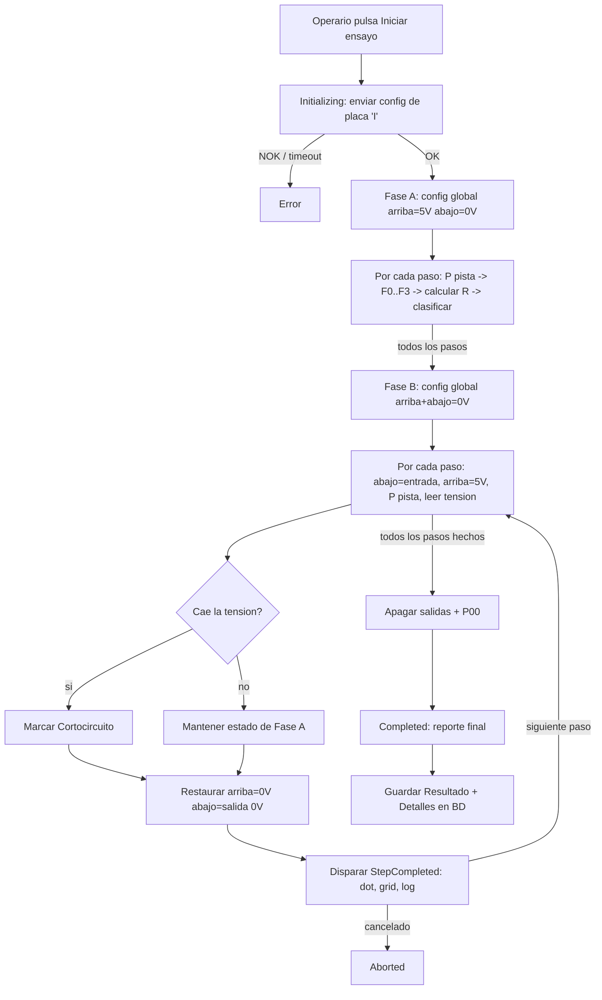

# Guía detallada — Modo Automático

Este documento explica, **paso a paso y con el detalle técnico interno**, cómo se ejecuta un ensayo en el modo **Automático** del PC7866: desde que el operario pulsa "Iniciar ensayo" hasta que el resultado queda guardado en base de datos.

Se accede desde el menú superior **Automático** (panel por defecto al abrir la aplicación).

## Componentes involucrados

- UI: [`Views/AutomaticTestPanel.cs`](Views/AutomaticTestPanel.cs) — orquesta la UI y delega la ejecución en la máquina de estados.
- Máquina de estados: [`Services/StateMachine/TestStateMachine.cs`](Services/StateMachine/TestStateMachine.cs) + estados en `Services/StateMachine/States/`.
- Protocolo serie: [`Models/Pc7866Commands.cs`](Models/Pc7866Commands.cs) (builders de tramas) y `Services/SerialCommunication/` (envío/parseo).
- Datos: `Models/Referencia.cs`, `Models/ParametroEnsayo.cs`, `Models/Resultado.cs`, `Models/ResultadoDetalle.cs`, persistidos vía `Services/Database/TestRepository.cs`.

## Requisito previo: Referencia y Parámetros de ensayo

Antes de ejecutar un ensayo automático debe existir en BD:

1. Una **Referencia** (`Referencia`), que además de nombre/imagen guarda la **configuración de placa**: `NumMcps` (nº de MCP23017 activos, 0-6), `Inh1Pos`..`Inh4Pos` (posición de pin 0-15 de cada inhibición, o libre elección), `Muestras` (nº de muestras para el promedio analógico) y `RetardoMs` (retardo antes de leer tras F/R).
2. Uno o varios **ParametroEnsayo** asociados a esa referencia — un registro por contacto/paso —, cada uno con: `NombreContacto`, `NPasoEnsayo` (orden), `McpArribaChip`/`McpArribaPin` y `McpAbajoChip`/`McpAbajoPin` (selectores de excitación 5V/masa usados por el algoritmo de medición, ver más abajo), `NSalida` (array de 96 bits, heredado, ya no se usa en el bucle de medición), `CanalMultiplexor` (nº de pista 0-48 para el comando `P`), `ResistenciaNominal`, `Tolerancia`, `Offset` y `ResistenciaMinima` (umbral de cortocircuito por software).

Sin al menos un parámetro para la referencia seleccionada, el botón **Iniciar ensayo** queda deshabilitado (`UpdateStartButton`).

## Paso 0 — Conexión y selección en la UI

1. El operario conecta el puerto serie (`btnConnect` → `_serialPort.Open(puerto, baudios)`).
2. Selecciona una **Referencia** en `cmbReferencia`. Esto dispara `OnReferenciaChangedAsync`, que carga `_parametros` desde BD (`GetParametrosByReferenciaAsync`) y resetea los indicadores visuales ("dots") de la imagen a gris.
3. Rellena **Operario** (obligatorio) y **Lote** (opcional).
4. Pulsa **Iniciar ensayo** (`BtnStartTest_Click`), que valida referencia/parámetros/operario, prepara la barra de progreso y llama a `TestStateMachine.RunAsync(...)`.

## Paso 1 — Estado `Initializing`

Clase [`InitializingState`](Services/StateMachine/States/InitializingState.cs):

1. Comprueba que el puerto serie siga abierto; si no, pasa a `Error`.
2. Construye y envía la trama de **configuración de placa** con el comando `I`:
   ```
   I <numMcps> <inh1> <inh2> <inh3> <inh4> <referencia:7> <muestras:2> <retardo:3>
   ```
   generada por `Pc7866Commands.BuildBoardConfigCommand(referencia.NumMcps, referencia.Inh1Pos..Inh4Pos, referencia.ReferenciaNombre, referencia.Muestras, referencia.RetardoMs)`. Cada `InhX` se codifica como dígito hexadecimal (0-F) o `'N'` si no está configurado.
3. Si la respuesta no empieza por `O` (OK), el ensayo pasa a `Error` y se aborta.
4. Si es OK, limpia los detalles previos del resultado y pasa a `Running`.

## Paso 2 — Estado `Running`: dos pasadas (resistencia + cortocircuito)

Clase [`RunningState`](Services/StateMachine/States/RunningState.cs). Los parámetros se ordenan por `NPasoEnsayo`. Antes de nada se calculan las máscaras globales "arriba"/"abajo" agregando `McpArribaChip/Pin` y `McpAbajoChip/Pin` de **todos** los pasos de la referencia.

**Fase A (resistencia)** — configuración global una única vez (todos los "arriba" salida a 5V, todos los "abajo" salida a 0V vía `M`+`S`) y luego, por cada paso: comprobar cancelación → reportar progreso (`"[Resistencia i/total] NombreContacto"`) → `P<CanalMultiplexor>` para seleccionar la pista → esperar 50 ms → leer `F0..F3` → calcular `Vain`, `Ve`, `R = Vain/(Ve−Vain)×390 − Offset` → clasificar provisionalmente `Ok`/`Nok`/`Abierto`/`Cortocircuito` (esta última solo si `R < ResistenciaMinima`). El detalle se guarda en memoria (todavía no se dispara `StepCompleted`).

**Fase B (cortocircuito)** — configuración global una única vez (todos los "arriba"+"abajo" salida a 0V, todo a masa) y luego, por cada paso: comprobar cancelación → reportar progreso (`"[Cortocircuito i/total] NombreContacto"`) → poner el "abajo" de ese paso como entrada (`M`) → poner su "arriba" a 5V (`S`) → `P<CanalMultiplexor>` → leer `F0`; si la tensión cae por debajo de 2,5V (o falla la lectura) se marca `Cortocircuito` sobre el detalle de la Fase A → restaurar "arriba" a 0V y "abajo" a salida 0V → **ahora sí** se dispara `StepCompleted`, que la UI usa para:
- Pintar el punto (dot) de ese paso sobre la imagen: verde=Ok, rojo=Nok, naranja=Cortocircuito, azul=Abierto.
- Añadir una fila a la tabla de resultados con paso, contacto, resistencia medida, nominal±tolerancia y etiqueta de resultado.
- Registrar la línea correspondiente en el log.

Si se pulsa "Abortar ensayo" en cualquier fase, el resultado global pasa a `Aborted`. Cualquier excepción durante un paso (timeout, error de parseo, etc.) se captura y ese paso se clasifica **Nok** (Fase A) o se trata como no concluyente (Fase B), sin interrumpir el resto del ensayo. Ver la sección ["Procedimiento eléctrico real"](#procedimiento-eléctrico-real-de-medición-fase-a-resistencia--fase-b-cortocircuito) más abajo para el detalle completo de tramas.

Al terminar ambas fases, `RunningState`:

- Envía `P00` para desconectar el multiplexor de medida.
- Envía una trama `S` por cada MCP con todas las salidas a 0, para dejar el banco en reposo.
- Marca `Resultado.ResultadoGlobal = true` solo si **todos** los pasos quedaron en `Ok`.
- Pasa a `Completed`.

## Procedimiento eléctrico real de medición (Fase A resistencia + Fase B cortocircuito)

> **Estado:** implementado en `Services/StateMachine/States/RunningState.cs`. Sustituye al
> esquema anterior (activar `NSalida` tal cual por paso, una sola fase).
>
> Mapeo de contactos: "arriba" = `ParametroEnsayo.McpArribaChip`/`McpArribaPin` y "abajo" =
> `ParametroEnsayo.McpAbajoChip`/`McpAbajoPin` de cada paso.
>
> **Decisiones tomadas por defecto (pendientes de validar con el hardware real):**
> - Umbral de "caída de tensión" en la Fase B: **2,5 V** (constante `CORTOCIRCUITO_VOLTAGE_THRESHOLD`
>   en `RunningState.cs`), asumido como la mitad de la excitación nominal de 5V a falta de un valor
>   confirmado. Ajustar esa constante si el hardware define otro valor.
> - Relación con la detección por software existente (`ResistenciaMinima`): **coexisten**. Si
>   cualquiera de los dos criterios (resistencia medida por debajo de `ResistenciaMinima`, o caída
>   de tensión detectada en la Fase B) indica cortocircuito, el paso se marca como `Cortocircuito`.

El ensayo se divide en **dos pasadas completas** sobre todos los pasos de la referencia (en ese orden: primero toda la Fase A, luego toda la Fase B):

### Fase A — Medición de resistencia

1. **Configuración global** (una sola vez, antes de recorrer las pistas): todos los pines "arriba"
   (de todos los pasos) se configuran como **salida** (`M`) y se ponen a **5V/HIGH** (`S`); todos los
   pines "abajo" se configuran como **salida** (`M`) y se ponen a **0V/LOW** (`S`).
2. Para cada paso, en orden: seleccionar la pista con `P<CanalMultiplexor>` y leer/calcular la
   resistencia (igual que antes: `F0..F3` → `Vain`, `Ve` → `R`). Se clasifica provisionalmente
   como `Ok`/`Nok`/`Abierto`/`Cortocircuito` (esta última solo por el umbral `ResistenciaMinima`).
3. No hace falta volver a tocar `M`/`S` entre pistas de esta fase: el multiplexor (`P`) es el que
   conmuta qué contacto se está midiendo; arriba/abajo quedan fijos en 5V/0V durante toda la fase.

### Fase B — Detección de cortocircuito

1. **Configuración global**: tanto los pines "arriba" como "abajo" (de todos los pasos) se
   configuran como **salida** (`M`) y se ponen a **0V/LOW** (`S`) — todo el banco a masa.
2. Para cada paso, en orden:
   - El pin "arriba" de ese paso concreto se pone a **5V/HIGH** (`S`), manteniendo el resto de
     "arriba"/"abajo" a 0V.
   - El pin "abajo" de ese paso concreto se reconfigura como **entrada** (`M`, en vez de salida a 0V).
   - Se selecciona la pista (`P<CanalMultiplexor>`) y se lee la tensión (`F0`).
   - Si la tensión leída cae por debajo del umbral (2,5V por defecto) o la lectura falla, se marca
     `Cortocircuito` (se combina con el resultado de la Fase A: prevalece sobre `Ok`/`Nok`, no sobre `Abierto`
     salvo que también caiga el umbral). Si no hay caída, el `Estado` de la Fase A se mantiene.
   - Antes de pasar al siguiente paso, se restaura el pin "abajo" a **salida a 0V** y el "arriba" de
     este paso vuelve a **0V**, dejando el banco a masa para el siguiente contacto.
   - Solo entonces (al cerrar la Fase B de ese paso) se dispara `StepCompleted` con el `ResultadoDetalle`
     final — durante la Fase A no se actualiza todavía el grid/imagen de la UI para ese paso.
3. Si un paso no tiene `McpArribaChip`/`McpAbajoChip` configurados, la comprobación de cortocircuito
   se omite para ese paso (se conserva el resultado de la Fase A).

### Notas de la implementación

- `RunningState.cs` calcula al inicio las máscaras de "todos los arriba" / "todos los abajo"
  agregando `McpArribaChip/Pin` y `McpAbajoChip/Pin` de **todos** los `ParametroEnsayo` de la
  referencia (no solo del paso actual), antes de arrancar la Fase A.
- Cualquier fallo de comunicación (timeout, respuesta `N`) durante la Fase B se trata como "no
  concluyente" (no se marca cortocircuito solo por eso); el fallo de comunicación ya queda
  reflejado por la clasificación `Nok` de la Fase A si corresponde.

## Paso 3 — Estado `Completed`

Clase [`CompletedState`](Services/StateMachine/States/CompletedState.cs): calcula cuántos pasos pasaron (`Ok`) sobre el total, reporta el mensaje final (`✅`/`❌ Ensayo completado: X/Y pasos OK`) y devuelve `Idle`, terminando el bucle de la máquina de estados.

## Paso 4 — Resultado final en la UI

`BtnStartTest_Click` recibe el `Resultado` devuelto por `RunAsync` y:

1. Muestra el resultado global (`ShowFinalResult`): `✅ BUENO` o `❌ MALO` con el conteo de pasos OK.
2. Llama a `SaveResultadoAsync(resultado)`.

## Paso 5 — Persistencia en base de datos

`SaveResultadoAsync`:

1. Si no hay repositorio/BD disponible, solo registra un aviso en el log — el ensayo no se pierde, simplemente no queda guardado.
2. Si hay BD: inserta la cabecera en `resultados` (`InsertResultadoAsync`, con `ReferenciaId`, `FechaPrueba`, `Operario`, `Lote`, `ResultadoGlobal`) y luego cada `ResultadoDetalle` en `resultados_detalle` (`InsertDetalleAsync`), enlazado por `ResultadoId`.
3. Cada fila de detalle guarda: `ParametroEnsayoId`, `NombreContacto`, `NPasoEnsayo`, `ResistenciaMedida` (`-1` si abierto), `ValorRawVain`/`ValorRawVe`, `Resultado` (bool) y `Estado` (`Ok`/`Nok`/`Cortocircuito`/`Abierto`).

## Cancelación (Abortar ensayo)

En cualquier momento del bucle de `Running`, pulsar **Abortar ensayo** cancela el `CancellationToken` compartido. El paso en curso lanza `OperationCanceledException` (o se detecta al inicio de la siguiente iteración), la máquina pasa a `Aborted`, y en la UI se registra "⛔ Ensayo cancelado" sin guardar resultado en BD.

## Resumen visual del flujo



## Consultar el histórico

Los resultados guardados se revisan luego desde el panel **Informes**, incluyendo el detalle por paso (`ResultadoDetalleForm`).

## Notas

- Si la BD no está disponible al abrir el panel, se registra un aviso en el log pero el panel sigue funcionando en local (no se podrán cargar referencias ni guardar resultados hasta restablecer la conexión).
- El modo automático no permite operar salidas individuales fuera del flujo del ensayo — para eso usa el [modo manual](GUIA_MODO_MANUAL.md).
