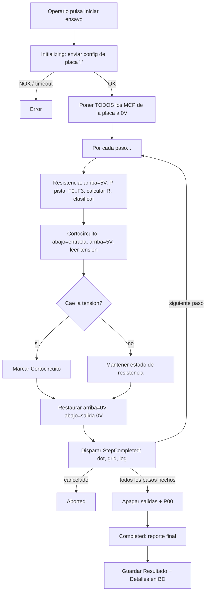

# Guía detallada — Modo Automático

Este documento explica, **paso a paso y con el detalle técnico interno**, cómo se ejecuta un ensayo en el modo **Automático** del PC7866: desde que el operario pulsa "Iniciar ensayo" hasta que el resultado queda guardado en base de datos.

Se accede desde el menú superior **Automático** (panel por defecto al abrir la aplicación).

## Componentes involucrados

- UI: [`Views/AutomaticTestPanel.cs`](Views/AutomaticTestPanel.cs) — orquesta la UI y delega la ejecución en la máquina de estados.
- Máquina de estados: [`Services/StateMachine/TestStateMachine.cs`](Services/StateMachine/TestStateMachine.cs) + estados en `Services/StateMachine/States/`.
- Protocolo serie: [`Models/Pc7866Commands.cs`](Models/Pc7866Commands.cs) (builders de tramas) y `Services/SerialCommunication/` (envío/parseo).
- Datos: `Models/Referencia.cs`, `Models/ParametroEnsayo.cs`, `Models/Resultado.cs`, `Models/ResultadoDetalle.cs`, persistidos vía `Services/Database/TestRepository.cs`.

## Requisito previo: Referencia y Parámetros de ensayo

Antes de ejecutar un ensayo automático debe existir en BD:

1. Una **Referencia** (`Referencia`), que además de nombre/imagen guarda la **configuración de placa**: `ModeloPlaca` (modelo de 6 dígitos que se envía en el comando `I`; si está vacío se usa el nombre de la referencia), `NumMcps` (nº de MCP23017 activos, 0-6), `Inh1Pos`..`Inh4Pos` (posición de pin 0-15 de cada inhibición, o libre elección), `Muestras` (nº de muestras para el promedio analógico) y `RetardoMs` (retardo antes de leer tras F/R).
2. Uno o varios **ParametroEnsayo** asociados a esa referencia — un registro por contacto/paso —, cada uno con: `NombreContacto`, `NPasoEnsayo` (orden), `McpArribaChip`/`McpArribaPin` y `McpAbajoChip`/`McpAbajoPin` (selectores de excitación 5V/masa usados por el algoritmo de medición, ver más abajo), `NSalida` (array de 96 bits, heredado, ya no se usa en el bucle de medición), `CanalMultiplexor` (nº de pista 0-48 para el comando `P`), `ResistenciaNominal`, `Tolerancia`, `Pendiente`, `Offset` y `ResistenciaMinima` (umbral de cortocircuito por software). `Pendiente` y `Offset` forman la función lineal de calibración aplicada a la resistencia bruta calculada (ver Paso 2); `Pendiente` por defecto es `1` (sin efecto sobre el cálculo anterior).

Sin al menos un parámetro para la referencia seleccionada, el botón **Iniciar ensayo** queda deshabilitado (`UpdateStartButton`).

## Paso 0 — Conexión y selección en la UI

1. El operario conecta el puerto serie (`btnConnect` → `_serialPort.Open(puerto, baudios)`).
2. Selecciona una **Referencia** en `cmbReferencia`. Esto dispara `OnReferenciaChangedAsync`, que carga `_parametros` desde BD (`GetParametrosByReferenciaAsync`) y resetea los indicadores visuales ("dots") de la imagen a gris.
3. Rellena **Operario** (obligatorio) y **Lote** (opcional).
4. Pulsa **Iniciar ensayo** (`BtnStartTest_Click`), que valida referencia/parámetros/operario, prepara la barra de progreso y llama a `TestStateMachine.RunAsync(...)`.

## Paso 1 — Estado `Initializing`

Clase [`InitializingState`](Services/StateMachine/States/InitializingState.cs):

1. Comprueba que el puerto serie siga abierto; si no, pasa a `Error`.
2. Construye y envía la trama de **configuración de placa** con el comando `I`:
   ```
   I <numMcps> <inh1> <inh2> <inh3> <inh4> <referencia:7> <muestras:2> <retardo:3>
   ```
   generada por `Pc7866Commands.BuildBoardConfigCommand(referencia.NumMcps, referencia.Inh1Pos..Inh4Pos, modelo, referencia.Muestras, referencia.RetardoMs)`, donde `modelo` es `referencia.ModeloPlaca` (o el nombre de la referencia si está vacío). Cada `InhX` se codifica como dígito hexadecimal (0-F) o `'N'` si no está configurado.
3. Si la respuesta no empieza por `O` (OK), el ensayo pasa a `Error` y se aborta.
4. Si es OK, limpia los detalles previos del resultado y pasa a `Running`.

## Paso 2 — Estado `Running`: ensayo punto a punto (resistencia + cortocircuito)

Clase [`RunningState`](Services/StateMachine/States/RunningState.cs). Los parámetros se ordenan por `NPasoEnsayo`. **Al inicio** se ponen TODOS los MCP de la placa (se usen o no, `0..NumMcps-1`) como **salida** (`M...FFFF`) y a **0V** (`S...0000`). Después el ensayo es **punto a punto**: por cada paso se mide su resistencia y, a continuación, se comprueba su cortocircuito, restaurando el paso antes de pasar al siguiente.

Por cada paso (comprobar cancelación → reportar progreso `"[i/total] NombreContacto"`):

1. **Resistencia** — poner su "arriba" a **5V** (`S`), su "abajo" ya está a 0V → `P<CanalMultiplexor>` para seleccionar la pista → esperar asentamiento (`SETTLE_DELAY_MS`) → leer `F0..F3` → calcular `Vain`, `Ve`, `R = Pendiente×(Vain/(Ve−Vain)×390) + Offset` (función lineal de calibración; `Pendiente=1`/`Offset=0` dejan el cálculo bruto). `F0` cambia con cada resistencia, pero `F1`/`F2`/`F3` son fijos en automático, así que se leen **una sola vez** (en el primer paso) y se reutilizan en los demás para acelerar el ensayo. El abierto/cortocircuito se detecta sobre la resistencia **bruta** (igual que el modo manual) y solo a lecturas válidas se aplica la calibración. Se clasifica `Ok`/`Nok`/`Abierto`/`Cortocircuito` (esta última si `R < ResistenciaMinima`).
2. **Cortocircuito** — poner su "abajo" como **entrada** (`M`, alta impedancia) manteniendo "arriba" a 5V y la pista ya seleccionada → esperar asentamiento → leer `F0`; si la tensión cae por debajo de **4,5V** (o falla la lectura) se marca `Cortocircuito` sobre el resultado del punto 1.
3. **Restaurar el paso** — "arriba" a **0V** (`S`), "abajo" de nuevo como **salida** (`M`) y a **0V** (`S`), dejando el banco a masa para el siguiente contacto.
4. Se dispara `StepCompleted` con el `ResultadoDetalle` final, que la UI usa para:
- Pintar el punto (dot) de ese paso sobre la imagen: verde=Ok, rojo=Nok, naranja=Cortocircuito, azul=Abierto.
- Añadir una fila a la tabla de resultados con paso, contacto, resistencia medida, nominal±tolerancia y etiqueta de resultado.
- Registrar la línea correspondiente en el log.

Si se pulsa "Abortar ensayo", el resultado global pasa a `Aborted`. Cualquier excepción durante un paso (timeout, error de parseo, etc.) se captura y ese paso se clasifica **Nok**, sin interrumpir el resto del ensayo; el paso siempre se restaura (bloque `finally`) antes de continuar. Ver la sección ["Procedimiento eléctrico real"](#procedimiento-eléctrico-real-de-medición-punto-a-punto) más abajo para el detalle completo de tramas.

Al terminar todos los pasos, `RunningState`:

- Envía `P00` para desconectar el multiplexor de medida.
- Envía una trama `S` por cada MCP con todas las salidas a 0, para dejar el banco en reposo.
- Marca `Resultado.ResultadoGlobal = true` solo si **todos** los pasos quedaron en `Ok`.
- Pasa a `Completed`.

## Procedimiento eléctrico real de medición (punto a punto)

> **Estado:** implementado en `Services/StateMachine/States/RunningState.cs`. Sustituye al
> esquema anterior (dos pasadas globales: toda la resistencia y luego todo el cortocircuito).
>
> Mapeo de contactos: "arriba" = `ParametroEnsayo.McpArribaChip`/`McpArribaPin` y "abajo" =
> `ParametroEnsayo.McpAbajoChip`/`McpAbajoPin` de cada paso.
>
> **Decisiones tomadas por defecto (pendientes de validar con el hardware real):**
> - Umbral de "caída de tensión" del cortocircuito: **4,5 V** (constante `CORTOCIRCUITO_VOLTAGE_THRESHOLD`
>   en `RunningState.cs`). Ajustar esa constante si el hardware define otro valor.
> - Relación con la detección por software existente (`ResistenciaMinima`): **coexisten**. Si
>   cualquiera de los dos criterios (resistencia medida por debajo de `ResistenciaMinima`, o caída
>   de tensión detectada) indica cortocircuito, el paso se marca como `Cortocircuito`.

El ensayo recorre los pasos de la referencia **uno a uno**; por cada paso se hace primero la
medición de resistencia y a continuación la comprobación de cortocircuito, antes de pasar al
siguiente.

### Configuración inicial (una sola vez)

Todos los MCP de la placa (`0..NumMcps-1`, se usen o no en algún paso) se configuran como **salida**
(`M<chip>SFFFF`) y se ponen a **0V/LOW** (`S<chip>0000`). Así se parte de todo el banco a masa.

### Por cada paso

1. **Resistencia** — el pin "arriba" de ese paso se pone a **5V/HIGH** (`S`), manteniendo su "abajo"
   a 0V. Se selecciona la pista con `P<CanalMultiplexor>` y se lee/calcula la resistencia (`F0..F3` →
   `Vain`, `Ve` → `R`). `F1`/`F2`/`F3` se leen solo en el primer paso y se reutilizan. Abierto/cortocircuito
   se detectan sobre la resistencia **bruta**; solo a lecturas válidas se aplica `R = Pendiente×R_bruta + Offset`.
2. **Cortocircuito** — el pin "abajo" de ese paso se reconfigura como **entrada** (`M`, alta
   impedancia), manteniendo su "arriba" a 5V y la pista ya seleccionada. Se lee la tensión
   (`F0`). Si la tensión cae por debajo del umbral (4,5V por defecto) o la lectura falla, se marca
   `Cortocircuito` (prevalece sobre el resultado de resistencia).
3. **Restaurar** — el pin "arriba" vuelve a **0V** (`S`), el "abajo" se reconfigura como **salida**
   (`M`) y se pone a **0V** (`S`), dejando el banco a masa para el siguiente contacto.
4. Solo entonces se dispara `StepCompleted` con el `ResultadoDetalle` final del paso.

Si un paso no tiene `McpArribaChip`/`McpAbajoChip` configurados (índice de bit inválido), se marca
**Nok** y se omiten las medidas de ese paso.

### Notas de la implementación

- El paso siempre se restaura en un bloque `finally`, incluso si hubo una excepción durante la
  medición, para no dejar salidas activas entre contactos.
- Cualquier fallo de comunicación (timeout, respuesta `N`) durante la comprobación de cortocircuito
  se trata como "no concluyente" (no se marca cortocircuito solo por eso).

## Paso 3 — Estado `Completed`

Clase [`CompletedState`](Services/StateMachine/States/CompletedState.cs): calcula cuántos pasos pasaron (`Ok`) sobre el total, reporta el mensaje final (`✅`/`❌ Ensayo completado: X/Y pasos OK`) y devuelve `Idle`, terminando el bucle de la máquina de estados.

## Paso 4 — Resultado final en la UI

`BtnStartTest_Click` recibe el `Resultado` devuelto por `RunAsync` y:

1. Muestra el resultado global (`ShowFinalResult`): `✅ BUENO` o `❌ MALO` con el conteo de pasos OK.
2. Llama a `SaveResultadoAsync(resultado)`.

## Paso 5 — Persistencia en base de datos

`SaveResultadoAsync`:

1. Si no hay repositorio/BD disponible, solo registra un aviso en el log — el ensayo no se pierde, simplemente no queda guardado.
2. Si hay BD: inserta la cabecera en `resultados` (`InsertResultadoAsync`, con `ReferenciaId`, `FechaPrueba`, `Operario`, `Lote`, `ResultadoGlobal`) y luego cada `ResultadoDetalle` en `resultados_detalle` (`InsertDetalleAsync`), enlazado por `ResultadoId`.
3. Cada fila de detalle guarda: `ParametroEnsayoId`, `NombreContacto`, `NPasoEnsayo`, `ResistenciaMedida` (`-1` si abierto), `ValorRawVain`/`ValorRawVe`, `Resultado` (bool) y `Estado` (`Ok`/`Nok`/`Cortocircuito`/`Abierto`).

## Cancelación (Abortar ensayo)

En cualquier momento del bucle de `Running`, pulsar **Abortar ensayo** cancela el `CancellationToken` compartido. El paso en curso lanza `OperationCanceledException` (o se detecta al inicio de la siguiente iteración), la máquina pasa a `Aborted`, y en la UI se registra "⛔ Ensayo cancelado" sin guardar resultado en BD.

## Resumen visual del flujo



## Consultar el histórico

Los resultados guardados se revisan luego desde el panel **Informes**, incluyendo el detalle por paso (`ResultadoDetalleForm`).

## Notas

- Si la BD no está disponible al abrir el panel, se registra un aviso en el log pero el panel sigue funcionando en local (no se podrán cargar referencias ni guardar resultados hasta restablecer la conexión).
- El modo automático no permite operar salidas individuales fuera del flujo del ensayo — para eso usa el [modo manual](GUIA_MODO_MANUAL.md).
